.. _2.-产品介绍:

2. 产品介绍
===========

.. _2.1-简介:

2.1 简介
--------

4WD蓝牙多功能智能车,是基于ARDUINO的开源机器人，可以让孩子们轻松学习编程,并且获得有关电子，机械，控制逻辑和计算机科学的实践知识。

他的安装和接线也十分简单，组件都通过螺钉和铜柱连接，只需要几个简单的步骤就可以组装完成。他提供了十多个编程的课程项目，由简单到复杂，一步一步，学习怎么去编写机器人能”听”懂的语言。

.. raw:: html

   <iframe src="//player.bilibili.com/player.html?bvid=BV1pT411w7UN&amp;page=1" scrolling="no" border="0" frameborder="no" framespacing="0" allowfullscreen="true" width="800" height="450">

.. raw:: html

   </iframe>

.. _2.2-特点:

2.2 特点
--------

#. 功能多多：避障功能，跟随功能，红外遥控，蓝牙控制，循迹功能，显示图案等。

#. 组装简单：无需焊接电路，只需几个简单的步骤即可组装该机器人。

#. 结构坚固：构成车体的部分是PCB材质，电机用是优质的金属电机。

#. 扩展性强：配置了电机驱动扩展板，可以扩展其他的传感器和模块。

#. 多种控制：红外遥控器控制，手机遥控控制（苹果和安卓手机都可）。

#. 学习基础编程：使用Arduino IDE的C语言编程，可以接触底层代码。

.. _2.3-参数:

2.3 参数
--------

工作电压：5v

输入电压：7-12V

最大输出电流：1A

最大耗散功率：25W（T=75℃）

电机转速：5V 63 rpm / min

电机驱动形式：双路H桥驱动

超声波感应角度：<15度

超声波探测距离：2cm-400cm

红外遥控距离：10米（实测）

蓝牙遥控距离：50米（实测）

蓝牙APP控制：支持Android和IOS系统

7.可接入外部DC 7~12V的电压。

.. _2.4-清单:

2.4 清单
--------

当收到这个智能车套件的时候，首先看到是一个包装精美的外盒，每个配件被安全且有序的装在外盒里面的小盒子里，先来清点一下：
+--------+--------+--------------------------+--------------------------+
| No     | P      | Quantity                 | Picture                  |
|        | roduct |                          |                          |
|        | Name   |                          |                          |
+========+========+==========================+==========================+
| 1      | keyes  | 1                        | |image1|                 |
|        | UNO R3 |                          |                          |
|        | 开发板 |                          |                          |
+--------+--------+--------------------------+--------------------------+
| 2      | 4      | 1                        | |image2|                 |
|        | WD车前 |                          |                          |
|        | 面LED  |                          |                          |
|        | 屏亚克 |                          |                          |
|        | 力挡板 |                          |                          |
+--------+--------+--------------------------+--------------------------+
| 3      | Keyes  | 1                        | |image3|                 |
|        | brick  |                          |                          |
|        | L298P  |                          |                          |
|        | 电     |                          |                          |
|        | 机驱动 |                          |                          |
|        | 扩展板 |                          |                          |
|        | V1     |                          |                          |
+--------+--------+--------------------------+--------------------------+
| 4      | Keyes  | 1                        | |image4|                 |
|        | B      |                          |                          |
|        | luetoo |                          |                          |
|        | th-4.0 |                          |                          |
|        | 蓝     |                          |                          |
|        | 牙4.0  |                          |                          |
|        | V2     |                          |                          |
+--------+--------+--------------------------+--------------------------+
| 5      | H      | 1                        | |image5|                 |
|        | C-SR04 |                          |                          |
|        | 超声波 |                          |                          |
|        | 传感器 |                          |                          |
+--------+--------+--------------------------+--------------------------+
| 6      | keyes  | 1                        | |image6|                 |
|        | 草帽L  |                          |                          |
|        | ED白发 |                          |                          |
|        | 红模块 |                          |                          |
+--------+--------+--------------------------+--------------------------+
| 7      | 3Pin   | 2                        | |image7|                 |
|        | 双母头 |                          |                          |
|        | 杜邦线 |                          |                          |
|        | 长20CM |                          |                          |
|        | 2.54mm |                          |                          |
+--------+--------+--------------------------+--------------------------+
| 8      | keyes  | 1                        | |image8|                 |
|        | 4WD    |                          |                          |
|        | 智能车 |                          |                          |
|        | V3.0   |                          |                          |
|        | PCB板  |                          |                          |
|        | (上板) |                          |                          |
+--------+--------+--------------------------+--------------------------+
| 9      | keyes  | 1                        | |image9|                 |
|        | 4WD    |                          |                          |
|        | 智能车 |                          |                          |
|        | V3.0   |                          |                          |
|        | PCB板  |                          |                          |
|        | (下板) |                          |                          |
+--------+--------+--------------------------+--------------------------+
| 10     | Keyes  | 1                        | |image10|                |
|        | conn   |                          |                          |
|        | ectors |                          |                          |
|        | 循迹   |                          |                          |
|        | 传感器 |                          |                          |
+--------+--------+--------------------------+--------------------------+
| 11     | keyes  | 1                        | |image11|                |
|        | brick  |                          |                          |
|        | 红     |                          |                          |
|        | 外接收 |                          |                          |
|        | 传感器 |                          |                          |
+--------+--------+--------------------------+--------------------------+
| 12     | 云     | 1                        | |image12|                |
|        | 台支架 |                          |                          |
|        | （黑色 |                          |                          |
|        | ）配套 |                          |                          |
|        | 固定   |                          |                          |
|        | 孔3MM  |                          |                          |
+--------+--------+--------------------------+--------------------------+
| 13     | SG90   | 1                        | |image13|                |
|        | 9G     |                          |                          |
|        | 舵机   |                          |                          |
+--------+--------+--------------------------+--------------------------+
| 14     | 186    | 1                        | |image14|                |
|        | 50双节 |                          |                          |
|        | 电池盒 |                          |                          |
+--------+--------+--------------------------+--------------------------+
| 15     | 6节5号 | 1                        | |image15|                |
|        | 电池盒 |                          |                          |
+--------+--------+--------------------------+--------------------------+
| 16     | k      | 1                        | |image16|                |
|        | eyes 8 |                          |                          |
|        | x16 LE |                          |                          |
|        | D灯板  |                          |                          |
+--------+--------+--------------------------+--------------------------+
| 17     | 2      | 1                        | |image17|                |
|        | 3\ *15 |                          |                          |
|        | *\ 5MM |                          |                          |
|        | 间     |                          |                          |
|        | 距9MM  |                          |                          |
|        | 铝     |                          |                          |
|        | 固定件 |                          |                          |
+--------+--------+--------------------------+--------------------------+
| 18     | 3mm    | 4                        | |image18|                |
|        | D型孔  |                          |                          |
|        | 轮胎   |                          |                          |
+--------+--------+--------------------------+--------------------------+
| 19     | 双通M  | 8                        | |image19|                |
|        | 3*10MM |                          |                          |
+--------+--------+--------------------------+--------------------------+
| 20     | 双通M  | 6                        | |image20|                |
|        | 3*40MM |                          |                          |
+--------+--------+--------------------------+--------------------------+
| 21     | M      | 8                        | |image21|                |
|        | 3*30MM |                          |                          |
|        | 圆头   |                          |                          |
|        | 十字   |                          |                          |
+--------+--------+--------------------------+--------------------------+
| 22     | M3*6MM | 45                       | |image22|                |
|        | 圆头   |                          |                          |
|        | 十字   |                          |                          |
+--------+--------+--------------------------+--------------------------+
| 23     | M3     | 20                       | |image23|                |
|        | 镀镍   |                          |                          |
+--------+--------+--------------------------+--------------------------+
| 24     | 3*40MM | 1                        | |image24|                |
|        | 红黑色 |                          |                          |
|        | 十字   |                          |                          |
|        | 螺丝刀 |                          |                          |
+--------+--------+--------------------------+--------------------------+
| 25     | M2*8MM | 10                       | |image25|                |
|        | 圆头   |                          |                          |
|        | 十字   |                          |                          |
+--------+--------+--------------------------+--------------------------+
| 26     | M2     | 10                       | |image26|                |
|        | 镀镍   |                          |                          |
+--------+--------+--------------------------+--------------------------+
| 27     | M      | 3                        | |image27|                |
|        | 3*10MM |                          |                          |
|        | 平头   |                          |                          |
+--------+--------+--------------------------+--------------------------+
| 28     | 4.5V   | 4                        | |image28|                |
|        | 20     |                          |                          |
|        | 0转/分 |                          |                          |
|        | 马达   |                          |                          |
+--------+--------+--------------------------+--------------------------+
| 29     | 5P     | 1                        | |image29|                |
|        | XH     |                          |                          |
|        | 2.54转 |                          |                          |
|        | PH2.0  |                          |                          |
|        | 26AWG  |                          |                          |
|        | 线长   |                          |                          |
|        | 200MM  |                          |                          |
+--------+--------+--------------------------+--------------------------+
| 30     | H      | 1                        | |image30|                |
|        | X-2.54 |                          |                          |
|        | 3P     |                          |                          |
|        | 双头   |                          |                          |
|        | 26AWG  |                          |                          |
|        | 黑红白 |                          |                          |
|        | 100mm  |                          |                          |
+--------+--------+--------------------------+--------------------------+
| 31     | H      | 1                        | |image31|                |
|        | X-2.54 |                          |                          |
|        | 4P     |                          |                          |
|        | 双头   |                          |                          |
|        | 26AWG  |                          |                          |
|        | 黑     |                          |                          |
|        | 棕白红 |                          |                          |
|        | 200mm  |                          |                          |
+--------+--------+--------------------------+--------------------------+
| 32     | H      | 1                        | |image32|                |
|        | X-2.54 |                          |                          |
|        | 4P     |                          |                          |
|        | 转杜邦 |                          |                          |
|        | 线母单 |                          |                          |
|        | 26AWG  |                          |                          |
|        | 黑     |                          |                          |
|        | 红白棕 |                          |                          |
|        | 200mm  |                          |                          |
+--------+--------+--------------------------+--------------------------+
| 33     | JMP-1  | 1                        | |image33|                |
|        | 1      |                          |                          |
|        | 7键86\ |                          |                          |
|        |  *40*\ |                          |                          |
|        |  6.5MM |                          |                          |
+--------+--------+--------------------------+--------------------------+
| 34     | USB线  | 1                        | |image34|                |
|        | AM/BM  |                          |                          |
|        | 透明蓝 |                          |                          |
|        | OD:5.0 |                          |                          |
|        | L=50cm |                          |                          |
+--------+--------+--------------------------+--------------------------+
| 35     | 缠绕管 | 0.1                      | |image35|                |
|        | 直     |                          |                          |
|        | 径8MM  |                          |                          |
|        | 黑色   |                          |                          |
+--------+--------+--------------------------+--------------------------+
| 36     | 黑色   | 10                       | |image36|                |
|        | 扎带   |                          |                          |
|        | 3      |                          |                          |
|        | *100MM |                          |                          |
+--------+--------+--------------------------+--------------------------+

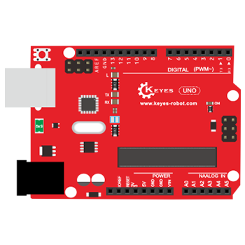
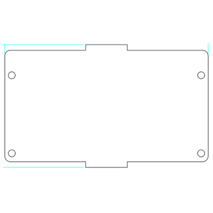
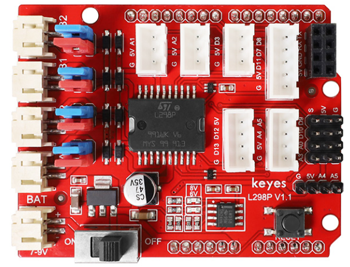
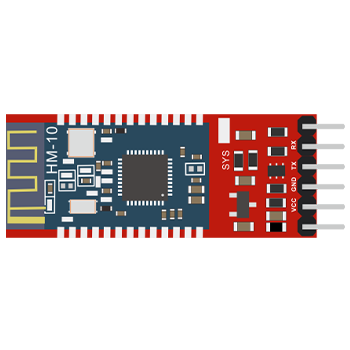
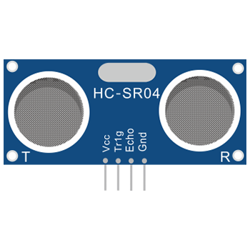
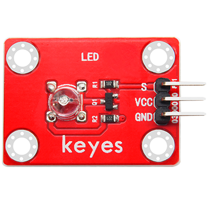
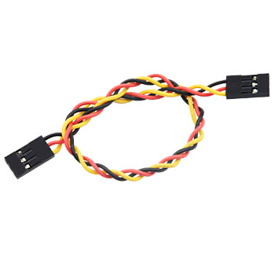
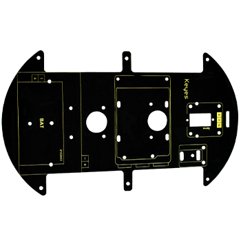
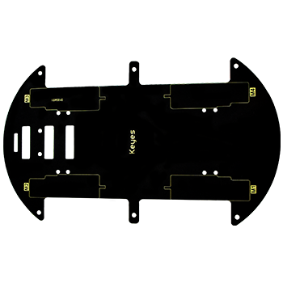
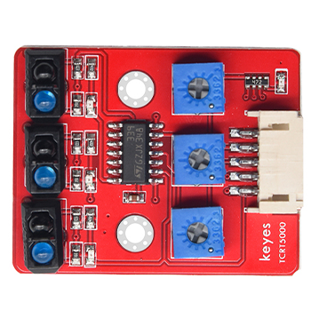
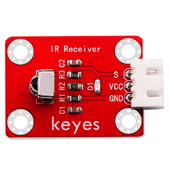
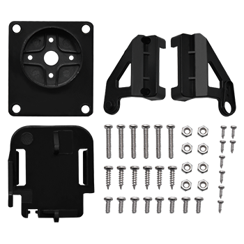
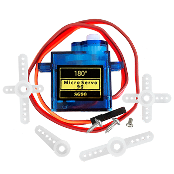
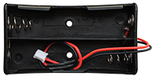
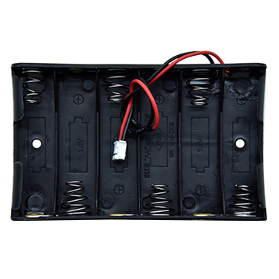
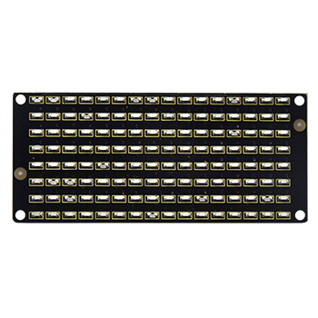
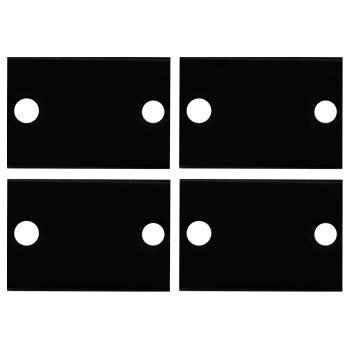
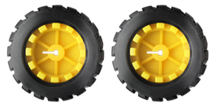
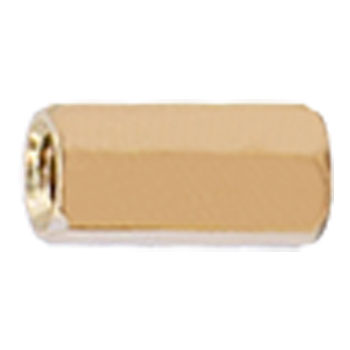

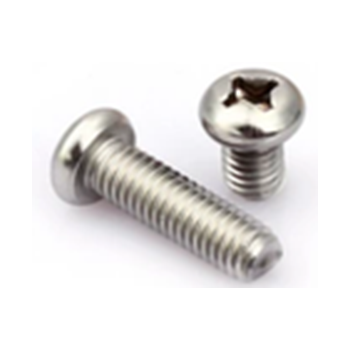

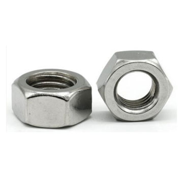
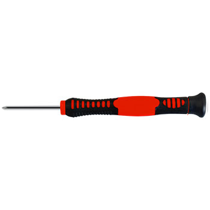

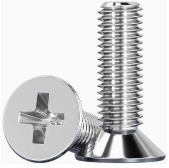
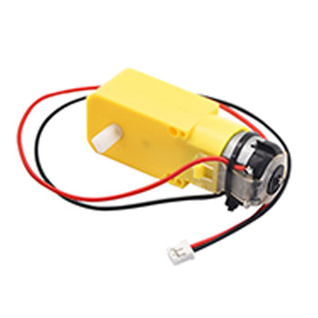
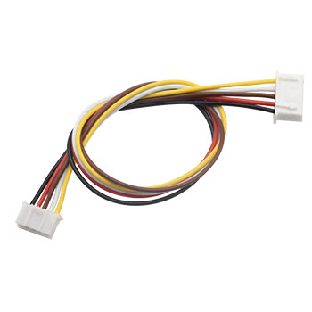
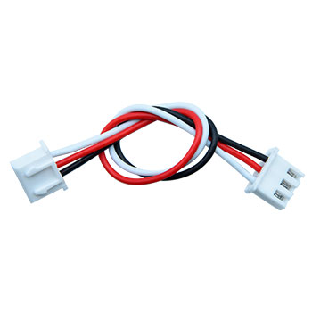
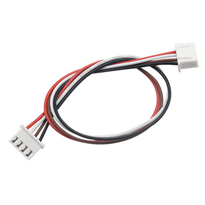
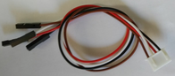

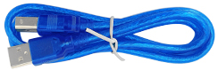
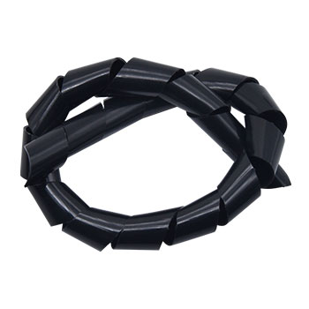
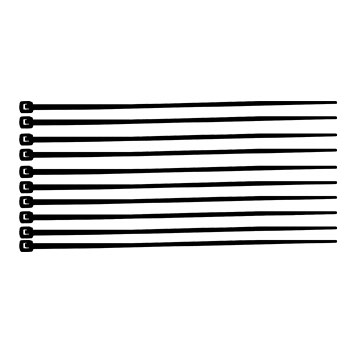
